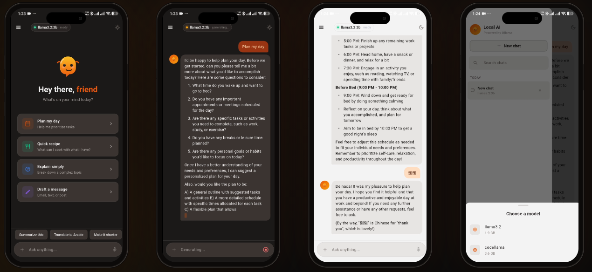
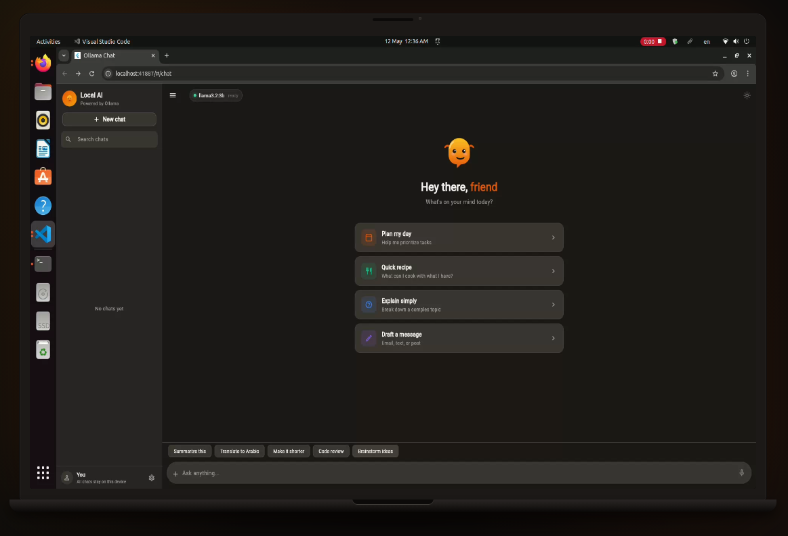
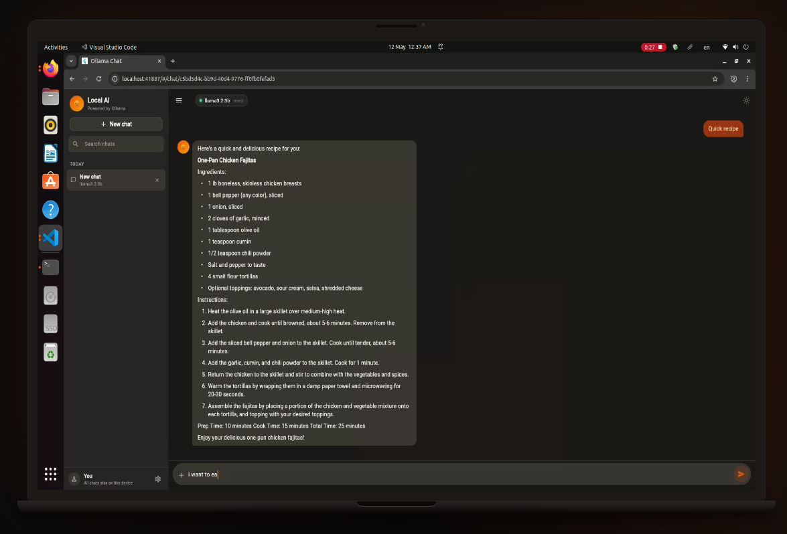
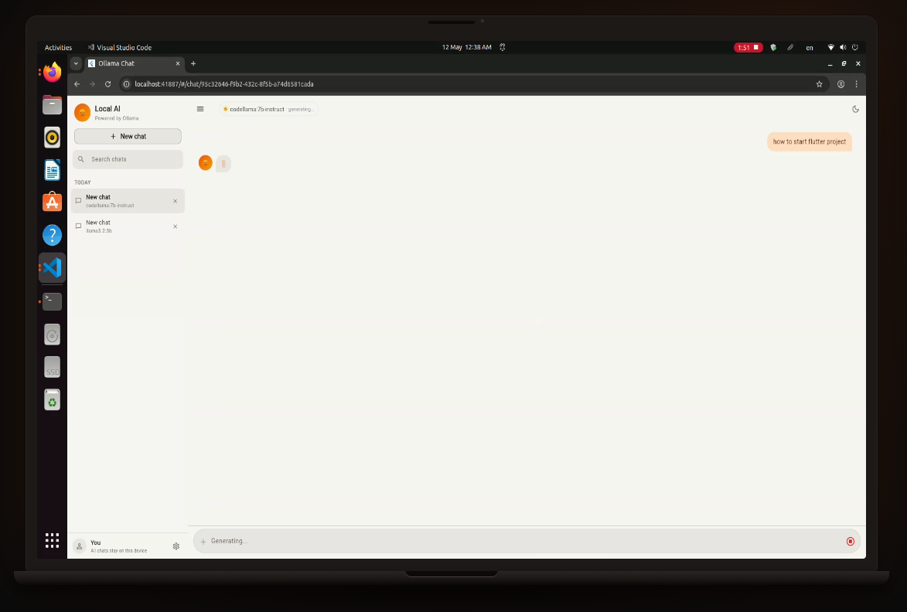

# Ollama Chat 🤖

A beautiful, open-source Flutter chat client for [Ollama](https://ollama.ai) — privacy-first, fully offline, cross-platform.


---

## Screenshots

### Mobile (Android)


### Desktop — Home & Chat (Dark)
<p float="left">
  
  
</p>

### Desktop — Chat (Light)


---

## Features

- **Multi-chat sessions** — create, switch, delete conversations
- **Model selector** — pick from all models installed in Ollama
- **Streaming responses** — token-by-token display with blinking cursor
- **Markdown rendering** — code blocks, bold, lists, headers
- **Persistent history** — sessions survive app restarts (Hive)
- **Settings** — custom Ollama host URL, theme, language
- **Responsive layout** — sidebar on desktop, drawer on mobile

## Platforms

| Platform | Status |
|---|---|
| Android | ✅ |
| iOS | ✅ |
| Linux | ✅ |
| Windows | ✅ |
| macOS | ✅ |
| Web | ✅ (requires CORS) |

---

## Getting started

### 1. Install Ollama

Download from [ollama.ai](https://ollama.ai) and pull a model:

```bash
ollama pull llama3
```

### 2. Clone and run

```bash
git clone https://github.com/MohamedOsama26/ollama-chat.git
cd ollama-chat
flutter pub get

# Run on Linux desktop
flutter run -d linux

# Run on Android (with device connected)
flutter run

# Run in browser (requires CORS)
OLLAMA_ORIGINS=* ollama serve
flutter run -d chrome
```

---

## Architecture

Clean Architecture + Bloc:

```
lib/
├── core/         # DI (get_it), router (go_router), theme, errors
├── domain/       # Entities, abstract repositories, use cases
├── data/         # Ollama API client (Dio + SSE), Hive local storage
└── features/
    ├── chat/     # ChatBloc, chat page, message bubble, input bar
    ├── sessions/ # SessionsBloc, sidebar, session list
    ├── models/   # ModelsBloc, model picker
    └── settings/ # SettingsBloc, settings page
```

## Contributing

Pull requests welcome! Areas to contribute:
- Egyptian Arabic localization strings
- Hugging Face model integration
- RAG document upload
- Image message support (for vision models)
- Voice input

## License

MIT — Mohamed Osama Kandil

